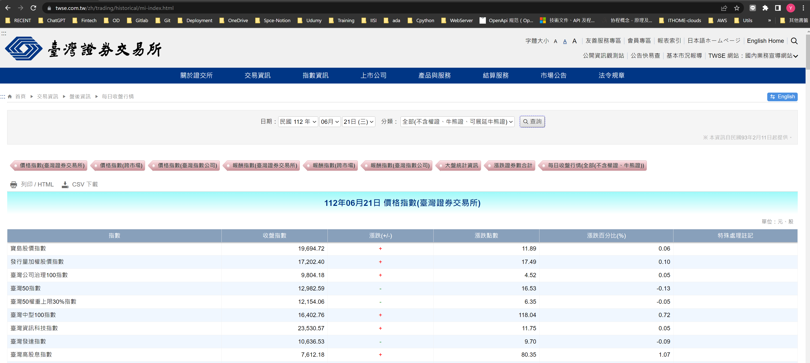
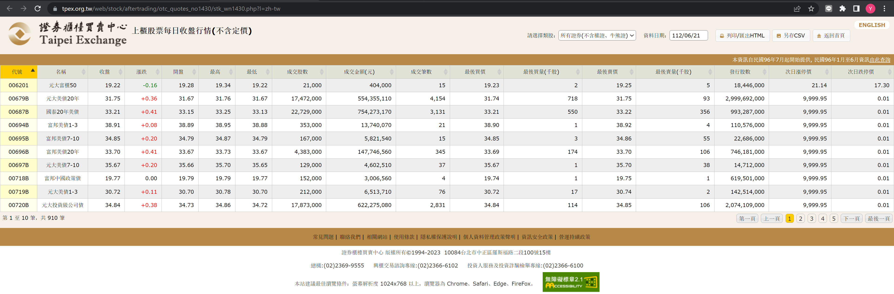

# 證券清單
```shell
source env.sh
python bin/update_security_list.py
```

# 每日收盤行情: 上市/櫃 股票/ETF
```shell
source env.sh
python bin/update_daily_price.py
```



# 月營收: 上市/櫃股票
```shell
source env.sh
python bin/update_monthly_revenue.py
```

# 價值分析: 上市/櫃股票
```shell
source env.sh
python bin/update_pera.py
```

# 財報: 上市/櫃股票
```shell
source env.sh
python bin/update_fin_stmt.py
```